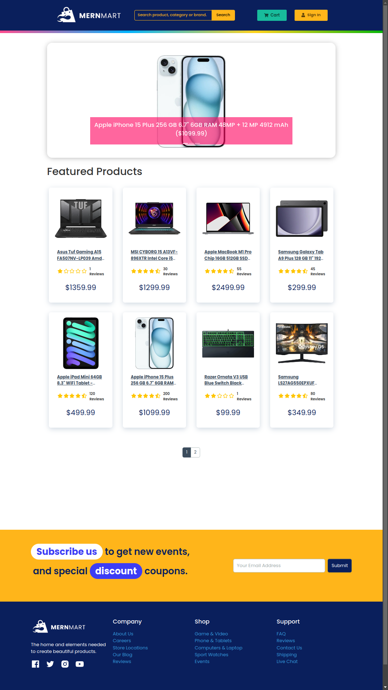

<<<<<<< HEAD
# Mernmart Project

> eCommerce platform built with the MERN stack & Redux.

### Click [here](https://mernmart.onrender.com/) to see live preview

# 

- [Technology Stack](#technology-stack)
- [Features](#features)
- [Usage](#usage)
  - [Env Variables](#env-variables)
  - [Install Dependencies (frontend & backend)](#install-dependencies-frontend--backend)
  - [Run](#run)
- [Build & Deploy](#build--deploy)
  - [Seed Database](#seed-database)

## Technology Stack

### Frontend:

- **React**: A JavaScript library for building user interfaces. React allows for efficient updating and rendering of components when data changes, making it ideal for building dynamic and interactive web applications.
- **React DOM**: Entry point of the DOM-related rendering paths. It works with React to render components to the DOM.
- **React Bootstrap**: Integration of React and Bootstrap. It allows for the use of Bootstrap components as React components, enabling responsive design with minimal effort.
- **React Router DOM**: Declarative routing for React apps. It enables navigation between different components and views, allowing for a single-page application experience.
- **Redux Toolkit**: A set of tools to simplify Redux development. It helps manage and centralize application state, making it easier to debug and maintain.
- **React Redux**: Official React bindings for Redux. It provides a way to connect React components to the Redux store.
- **React Toastify**: A library to add toast notifications to React applications. It provides an easy way to show feedback messages to users.
- **React Helmet Async**: A library to manage changes to the document head. It is useful for managing meta tags dynamically, improving SEO.
- **Axios**: A promise-based HTTP client for making API calls. It simplifies making requests to the backend and handling responses.
- **Bootstrap**: A CSS framework for developing responsive and mobile-first websites. It provides pre-designed components and styles, speeding up development.
- **React Icons**: A collection of popular icons for React applications. It allows for easy integration of icons into the user interface.
<!-- Stripe Frontend stuff goes here (
  "@stripe/react-stripe-js": "^2.7.3",
    "@stripe/stripe-js": "^4.1.0",
) -->

### Backend:

- **Node.js**: A JavaScript runtime built on Chrome's V8 JavaScript engine. It allows for building scalable network applications with JavaScript on the server side.
- **Express.js**: A web application framework for Node.js. It simplifies the creation of robust APIs and handles routing, middleware, and more.
- **Mongoose**: An Object Data Modeling (ODM) library for MongoDB and Node.js. It provides a schema-based solution to model application data, making it easier to work with MongoDB.
- **jsonwebtoken**: A library to work with JSON Web Tokens (JWT). It is used for authentication, allowing secure transmission of information between parties.
- **bcryptjs**: A library to hash passwords. It ensures that passwords are securely stored by hashing them before saving to the database.
- **Cookie-parser**: A middleware to parse cookies. It simplifies cookie management in Express applications.
- **CORS**: A package for providing a Connect/Express middleware that can be used to enable CORS with various options. It allows the server to indicate any other origins (domain, scheme, or port) from which a browser should permit loading resources.
<!-- - **Iyzipay**: A library for integrating the Iyzipay payment gateway. It facilitates secure and easy payment processing.-->
- **Multer**: A middleware for handling multipart/form-data, used for uploading files. It is essential for handling file uploads in web applications.
- **Nodemailer**: A module for Node.js applications to send emails. It simplifies the process of sending emails from the server, which is useful for notifications and other email communications.
- **EJS**: A templating language that lets you generate HTML markup with plain JavaScript. It is often used with Nodemailer to create HTML/CSS email templates, allowing for the creation of visually appealing and dynamic emails to be sent to users.
<!-- - **Stripe**: description goes here -->

### Development Tools:

- **Postman:**: A platform for API development. It allows developers to design, test, and document APIs, making it easier to debug and ensure the correct functioning of the backend services. Postman provides a user-friendly interface to send requests, inspect responses, and automate testing.
- **Nodemon:** A tool that helps develop Node.js-based applications by automatically restarting the node application when file changes are detected. It improves the development workflow by reducing manual restarts.
- **Dotenv:** A module that loads environment variables from a .env file into process.env. It helps manage environment-specific configurations securely.
- **Concurrently:** A utility that allows running multiple commands concurrently. It is useful for running both the frontend and backend servers simultaneously during development.

With this setup, the project leverages the MERN stack (MongoDB, Express.js, React, and Node.js) to build a comprehensive e-commerce platform with various advanced features. These technologies collectively enhance the development process, providing tools for state management, client-server communication, authentication, file handling, and more, resulting in a robust and scalable application.

## Features

### User Features

- **Full Featured Shopping Cart**: Users can add items to the cart, view the cart, and manage item quantities.
- **Product Reviews and Ratings**: Users can leave reviews and ratings for products, helping other customers make informed decisions.
- **Top Products Carousel**: A visually appealing carousel showcasing top-rated products to attract user attention.
- **Product Pagination**: Products are displayed with pagination to improve navigation and user experience.
- **Product Search Feature**: Users can search for products using keywords to quickly find what they need.
- **User Profile with Orders**: Users can view and manage their profiles, including order history and personal details.
- **Checkout Process**: A comprehensive checkout process that includes steps for shipping, payment methods, and order confirmation.
- **Stripe Payment Integration**: Secure payment via Stripe payment APIs enhancing trust and convenience along with the Stripe Embedded Checkout Form.

### Admin Features

- **Admin Product Management**: Admins can add, edit and delete products, ensuring the product catalog is up-to-date.
  <!-- Additionally, after adding and editing a product, product page preview functionality added for admin users. --> (not added yet)
- **Admin User Management**: Admins can manage user accounts, including adding, editing, and deleting users.
- **Admin Order Details Page**: Admins can view detailed information about each order, including user and product details.
- **Mark Orders as Delivered Option**: Admins can update the status of orders to mark them as delivered, ensuring accurate order tracking.

### Additional Features

- **Product Pagination and Search**: Enhances user experience by allowing easy navigation and quick access to desired products.
- **Product Carousel**: Highlights top products in a rotating banner, attracting user attention to featured items. The sorting algorithm of the featured products can easily be changed on the backend.
- **Database Seeder**: A utility to seed the database with initial data, such as products and users, for testing and development purposes.
- **Responsive Design**: The application is fully responsive, providing a seamless experience across desktop, tablet, and mobile devices.
- **Authentication and Authorization**: Secure user authentication using JWT, with role-based authorization to protect admin routes and features.
- **Error Handling**: Robust error handling across the application, ensuring a smooth user experience even when issues arise.
- **State Management with Redux**: Centralized state management for predictable state updates, simplifying the development and maintenance of complex features.
- **Environment Variables**: Configuration via environment variables for flexibility and security in different deployment environments.
- **Modern UI/UX**: Clean and modern user interface design for an engaging and intuitive user experience.

These features collectively provide a comprehensive and robust e-commerce platform, enhancing both user and admin experiences while ensuring security, scalability, and maintainability.

## Usage

- Create a MongoDB database and obtain your `MongoDB URI` - [MongoDB Atlas](https://www.mongodb.com/cloud/atlas/register)
- Create a Iyzico account and obtain your `API Key` and `Secret Key` - [Iyzico Sandbox](https://docs.iyzico.com/v/en/getting-started/preliminaries/sandbox/)

### Env Variables

Rename the `.env.example` file to `.env` and add the following

```
NODE_ENV = development
PORT = 5000
MONGO_URI = your mongodb uri
JWT_SECRET = abc123
IYZICO_API_KEY = your iyzico api key
IYZICO_SECRET_KEY = your iyzico api key
IYZICO_BASE_URL = https://sandbox-api.iyzipay.com
SMTP_EMAIL_USER = your smtp email user
SMTP_EMAIL_PASSWORD = your smtp password
PAGINATION_LIMIT = 8
```

Change the JWT_SECRET and PAGINATION_LIMIT to what you want

### Install Dependencies (frontend & backend)

```
npm install
cd frontend
npm install
```

### Run

```
# Run frontend (:3000) & backend (:5000)
npm run dev

# Run backend only
npm run server
```

## Build & Deploy

```
# Create frontend production build
cd frontend
npm run build
```

### Seed Database

You can use the following commands to seed the database with some sample users and products as well as destroy all data

```
# Import data
npm run data:import

# Destroy data
npm run data:destroy
```

### Sample Admin User

- **Email:** admin@email.com
- **Password:** 123456

##
=======
# Mernmart Project

> eCommerce platform built with the MERN stack & Redux.

### Click [here](https://proshopdemo.dev) to see live preview

# 

- [Technology Stack](#technology-stack)
- [Features](#features)
- [Usage](#usage)
  - [Env Variables](#env-variables)
  - [Install Dependencies (frontend & backend)](#install-dependencies-frontend--backend)
  - [Run](#run)
- [Build & Deploy](#build--deploy)
  - [Seed Database](#seed-database)

## Technology Stack

### Frontend:

- **React**: A JavaScript library for building user interfaces. React allows for efficient updating and rendering of components when data changes, making it ideal for building dynamic and interactive web applications.
- **React DOM**: Entry point of the DOM-related rendering paths. It works with React to render components to the DOM.
- **React Bootstrap**: Integration of React and Bootstrap. It allows for the use of Bootstrap components as React components, enabling responsive design with minimal effort.
- **React Router DOM**: Declarative routing for React apps. It enables navigation between different components and views, allowing for a single-page application experience.
- **Redux Toolkit**: A set of tools to simplify Redux development. It helps manage and centralize application state, making it easier to debug and maintain.
- **React Redux**: Official React bindings for Redux. It provides a way to connect React components to the Redux store.
- **React Toastify**: A library to add toast notifications to React applications. It provides an easy way to show feedback messages to users.
- **React Helmet Async**: A library to manage changes to the document head. It is useful for managing meta tags dynamically, improving SEO.
- **Axios**: A promise-based HTTP client for making API calls. It simplifies making requests to the backend and handling responses.
- **Bootstrap**: A CSS framework for developing responsive and mobile-first websites. It provides pre-designed components and styles, speeding up development.
- **React Icons**: A collection of popular icons for React applications. It allows for easy integration of icons into the user interface.
<!-- - **React Credit Cards**: A library to display credit card previews. It enhances the user experience during payment processes by showing a visual representation of credit card inputs. (Iyzico Checkout Form ???) -->

### Backend:

- **Node.js**: A JavaScript runtime built on Chrome's V8 JavaScript engine. It allows for building scalable network applications with JavaScript on the server side.
- **Express.js**: A web application framework for Node.js. It simplifies the creation of robust APIs and handles routing, middleware, and more.
- **Mongoose**: An Object Data Modeling (ODM) library for MongoDB and Node.js. It provides a schema-based solution to model application data, making it easier to work with MongoDB.
- **jsonwebtoken**: A library to work with JSON Web Tokens (JWT). It is used for authentication, allowing secure transmission of information between parties.
- **bcryptjs**: A library to hash passwords. It ensures that passwords are securely stored by hashing them before saving to the database.
- **Cookie-parser**: A middleware to parse cookies. It simplifies cookie management in Express applications.
- **CORS**: A package for providing a Connect/Express middleware that can be used to enable CORS with various options. It allows the server to indicate any other origins (domain, scheme, or port) from which a browser should permit loading resources.
- **Iyzipay**: A library for integrating the Iyzipay payment gateway. It facilitates secure and easy payment processing.
- **Multer**: A middleware for handling multipart/form-data, used for uploading files. It is essential for handling file uploads in web applications.
- **Nodemailer**: A module for Node.js applications to send emails. It simplifies the process of sending emails from the server, which is useful for notifications and other email communications.
- **EJS**: A templating language that lets you generate HTML markup with plain JavaScript. It is often used with Nodemailer to create HTML/CSS email templates, allowing for the creation of visually appealing and dynamic emails to be sent to users.

### Development Tools:

- **Postman:**: A platform for API development. It allows developers to design, test, and document APIs, making it easier to debug and ensure the correct functioning of the backend services. Postman provides a user-friendly interface to send requests, inspect responses, and automate testing.
- **Nodemon:** A tool that helps develop Node.js-based applications by automatically restarting the node application when file changes are detected. It improves the development workflow by reducing manual restarts.
- **Dotenv:** A module that loads environment variables from a .env file into process.env. It helps manage environment-specific configurations securely.
- **Concurrently:** A utility that allows running multiple commands concurrently. It is useful for running both the frontend and backend servers simultaneously during development.

With this setup, the project leverages the MERN stack (MongoDB, Express.js, React, and Node.js) to build a comprehensive e-commerce platform with various advanced features. These technologies collectively enhance the development process, providing tools for state management, client-server communication, authentication, file handling, and more, resulting in a robust and scalable application.

## Features

### User Features

- **Full Featured Shopping Cart**: Users can add items to the cart, view the cart, and manage item quantities.
- **Product Reviews and Ratings**: Users can leave reviews and ratings for products, helping other customers make informed decisions.
- **Top Products Carousel**: A visually appealing carousel showcasing top-rated products to attract user attention.
- **Product Pagination**: Products are displayed with pagination to improve navigation and user experience.
- **Product Search Feature**: Users can search for products using keywords to quickly find what they need.
- **User Profile with Orders**: Users can view and manage their profiles, including order history and personal details.
- **Checkout Process**: A comprehensive checkout process that includes steps for shipping, payment methods, and order confirmation.
- **Iyzico Payment Integration**: Secure payment via Iyzico payment APIs enhancing trust and convenience along with the Iyzico Checkout Form.

### Admin Features

- **Admin Product Management**: Admins can add, edit and delete products, ensuring the product catalog is up-to-date. Additionally, after adding and editing a product, product page preview functionality added for admin users.
- **Admin User Management**: Admins can manage user accounts, including adding, editing, and deleting users.
- **Admin Order Details Page**: Admins can view detailed information about each order, including user and product details.
- **Mark Orders as Delivered Option**: Admins can update the status of orders to mark them as delivered, ensuring accurate order tracking.

### Additional Features

- **Product Pagination and Search**: Enhances user experience by allowing easy navigation and quick access to desired products.
- **Product Carousel**: Highlights top products in a rotating banner, attracting user attention to featured items. The sorting algorithm of the featured products can easily be changed on the backend.
- **Database Seeder**: A utility to seed the database with initial data, such as products and users, for testing and development purposes.
- **Responsive Design**: The application is fully responsive, providing a seamless experience across desktop, tablet, and mobile devices.
- **Authentication and Authorization**: Secure user authentication using JWT, with role-based authorization to protect admin routes and features.
- **Error Handling**: Robust error handling across the application, ensuring a smooth user experience even when issues arise.
- **State Management with Redux**: Centralized state management for predictable state updates, simplifying the development and maintenance of complex features.
- **Environment Variables**: Configuration via environment variables for flexibility and security in different deployment environments.
- **Modern UI/UX**: Clean and modern user interface design for an engaging and intuitive user experience.

These features collectively provide a comprehensive and robust e-commerce platform, enhancing both user and admin experiences while ensuring security, scalability, and maintainability.

## Usage

- Create a MongoDB database and obtain your `MongoDB URI` - [MongoDB Atlas](https://www.mongodb.com/cloud/atlas/register)
- Create a Iyzico account and obtain your `API Key` and `Secret Key` - [Iyzico Sandbox](https://docs.iyzico.com/v/en/getting-started/preliminaries/sandbox/)

### Env Variables

Rename the `.env.example` file to `.env` and add the following

```
NODE_ENV = development
PORT = 5000
MONGO_URI = your mongodb uri
JWT_SECRET = abc123
IYZICO_API_KEY = your iyzico api key
IYZICO_SECRET_KEY = your iyzico api key
IYZICO_BASE_URL = https://sandbox-api.iyzipay.com
SMTP_EMAIL_USER = your smtp email user
SMTP_EMAIL_PASSWORD = your smtp password
PAGINATION_LIMIT = 8
```

Change the JWT_SECRET and PAGINATION_LIMIT to what you want

### Install Dependencies (frontend & backend)

```
npm install
cd frontend
npm install
```

### Run

```
# Run frontend (:3000) & backend (:5000)
npm run dev

# Run backend only
npm run server
```

## Build & Deploy

```
# Create frontend production build
cd frontend
npm run build
```

### Seed Database

You can use the following commands to seed the database with some sample users and products as well as destroy all data

```
# Import data
npm run data:import

# Destroy data
npm run data:destroy
```

### Sample Admin User

- **Email:** admin@email.com
- **Password:** 123456

##
>>>>>>> d283eab (done.)
